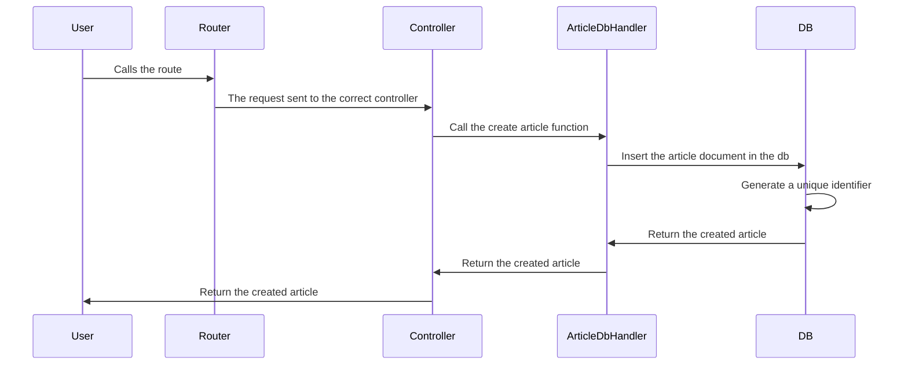
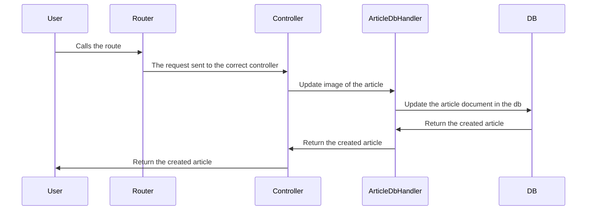
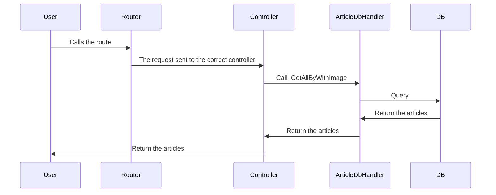

# Article Management server

This is my entry for the article management server. I focused on the implementation of the requirements. I stayed with what I knew for technologies. For testing I tried to have a good mix of integration a nd unit testing. I added a few TODOs for items that I would have liked to go through in the future and also to show that i have thought about these items but didn't have to do so e.g MIME types.

## How to run in Docker

```bash
docker-compose up
```

## How to run locally

### Environment

MONGOD_PATH: the full-path to the mongod binary on your system. A mongod binary is included in the repo at `./mongod_6_0_11`. Note that this is Linux only. If you for example have a Darwin system, you will need to install it yourself.

### Testing

```bash
MONGOD_PATH=<MONGOD_PATH> go test -v ./...
```

### Running

```bash
MONGOD_PATH=<MONGOD_PATH> go run main.go
```

### Building

```bash
MONGOD_PATH=<MONGOD_PATH> go build main.go
```

## JSON-RPC Endpoints

### POST /article

This will create the article and will return the article id for the given post request.

#### Arguments for POST /article

| Body             |   Type    | Required | Description                              |
| :--------------- | :-------: | :------: | :--------------------------------------- |
| `tile`           |  string   |   Yes    | The title of the given article           |
| `expirationDate` | time.Time |   Yes    | The expiration date of the given article |
| `description`    |  string   |   Yes    | The description of the given article     |

#### Response for POST /article

| Parameter |  Type  |  Description   |
| :-------: | :----: | :------------: |
|   `id`    | string | The article id |

#### Diagram for for POST /article



### POST /image/:articleId/

Appends an image to a given article. The limit is 3 images per article.

### Arguments for POST /image/:articleId/

| Form-Data | Type  | Required | Description                              |
| :-------- | :---: | :------: | :--------------------------------------- |
| `file`    | image |   Yes    | The Image to append to the given article |

#### Diagram for POST /image/:articleId/



### GET /article?withImage=bool

Retrieves articles based upon the query param.

### Arguments for /article?withImage=bool

| Params       |  Type   | Required | Description                                                                                                                                |
| :----------- | :-----: | :------: | :----------------------------------------------------------------------------------------------------------------------------------------- |
| `withImages` | boolean |    No    | When withImages is true returns all articles with images. If false returns all articles without images. If undefined returns all articles. |

#### Response for /article?withImage=bool

| Parameter |  Type  |                    Description                     |
| :-------: | :----: | :------------------------------------------------: |
|  `title`  | string | The title of the articles based on the query param |



#### TODO

- Add OpenApi documentation
- MIME detection
